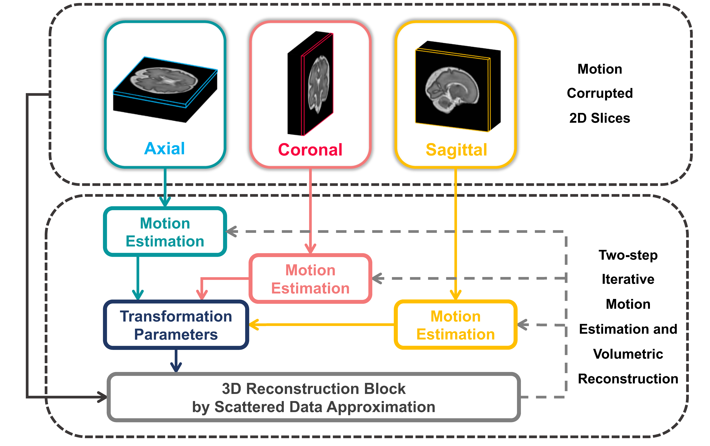

# AFFIRM: Affinity Fusion-based Framework for Iteratively Random Motion correction of multi-slice fetal brain MRI 
This repository contains relevant code and demo using a deep recursive fetal motion estimation and correction based on slice and volume affinity fusion, i.e., AFFIRM. The concept can be applied to any similar scenario. The relevant work is published in IEEE Transactions on Medical Imaging [(https://ieeexplore.ieee.org/document/9896894)][reference].

Feel free to contact me (allard.w.shi at gmail dot com) or open an issue if you have any question or comment. 

## Introduction
AFFIRM is a motion correction algorithm for high-resolution fetal brain 3D volumetric reconstruction from motion-corrupted multi-slice MRI data. It has several merits including:
* using a bi-directional network architecture that takes the stack of slices as a time series to learn the **sequential motion information** and utilizing **complementary information across stacks**. 
* employing a **scattered data approximation module** for fast 3D reconstruction of the 2D stacks as well as an **affinity fusion strategy** to integrate the features between 2D slices and 3D volume. 
* working as a coarse-to-fine process when integrated with conventional pipeline to tackle both small- and large-scale motions.
* increasing the overall success rate of super-resolution reconstruction. 

   

Figure 1. Schematic diagram of AFFIRM. 

## Compared algorithms
This work compared other conventional methods as well as deep learning-based motion correction or motion tracking algorithms, especially in fetal MR imaging, as the following.
* [SVRnet](https://ieeexplore.ieee.org/abstract/document/8295121/) Hou Benjamin, et al. "3-D reconstruction in canonical co-ordinate space from arbitrarily oriented 2-D images." 
IEEE transactions on medical imaging 37.8 (2018): 1737-1750.
* [Deep Pose Estimation](https://ieeexplore.ieee.org/abstract/document/8443391/) Salehi, Seyed Sadegh Mohseni, et al. "Real-time deep pose estimation with geodesic loss for image-to-template rigid registration." 
IEEE transactions on medical imaging 38.2 (2018): 470-481.
* [NiftyMIC](https://github.com/gift-surg/NiftyMIC) Ebner, Michael, et al. "An automated framework for localization, segmentation and super-resolution reconstruction of fetal brain MRI." NeuroImage 206 (2020): 116324.
* [Deep Predictive Motion Tracking](https://ieeexplore.ieee.org/abstract/document/9103624/) Singh Ayush, Seyed Sadegh Mohseni Salehi, and Ali Gholipour. "Deep Predictive Motion Tracking in Magnetic Resonance Imaging: Application to Fetal Imaging." 
IEEE Transactions on Medical Imaging (2020).

The specific algorithms were modified and reproduced from the following repositories:
* [SVRnet](https://github.com/farrell236/SVRnet)
* [DeepRegistration](https://github.com/SadeghMSalehi/DeepRegistration)
* [DeepPredictiveMotionTracking](https://github.com/bchimagine/DeepPredictiveMotionTracking)

Other used repository links:
* [voxelmorph](https://github.com/voxelmorph/voxelmorph)

## Setup
* Tensorflow 1.14.0
* Keras 2.2.5
* [NiftyMIC v0.9] (https://github.com/gift-surg/NiftyMIC)
* [FMRIB Software Library v6.0] (https://fsl.fmrib.ox.ac.uk/fsl/fslwiki)
* itk 5.2.1
* SimpleITK 1.2.4
* pysitk 0.2.19
* nipype 1.16.4

## Training and Application
**Training**: please refer to train.py and prepare two files in *.npy as training and validation set using data_complie.py. 

**Testing**: We provide one 37-GA real-world demo in the folder ./Data/demo/. Two steps are thus needed:
* Run `main.py` to estimate the fetal brain motion.
* Use NiftyMIC command `niftymic_reconstruct_volume_from_slices`to perform super-resolution reconstruction.
* Rerun `main.py` by setting `init_reference = False` and repeat step 2&3 several times to correct the motion.

## How to cite
If you find the code useful, please consider to cite our work.
* [[Shi2022]][reference] W. Shi et al., "AFFIRM: Affinity Fusion-based Framework for Iteratively Random Motion correction of multi-slice fetal brain MRI," in IEEE Transactions on Medical Imaging, 2022, doi: 10.1109/TMI.2022.3208277.

[reference]: https://ieeexplore.ieee.org/document/9896894
